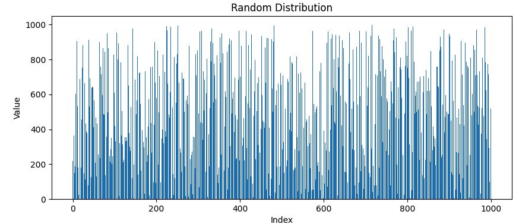
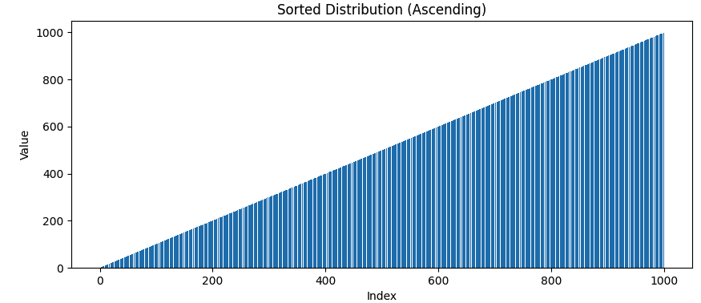
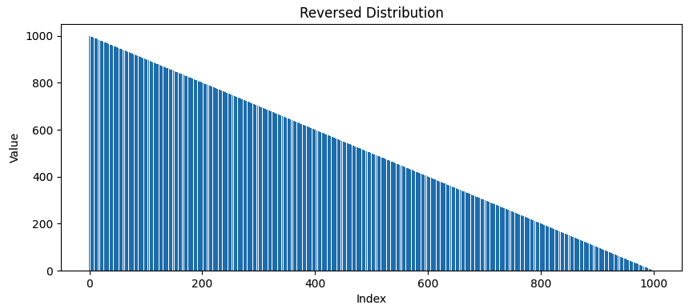

# sorting-alg-benchmark
A comprehensive C++ project benchmarking the performance of various sorting algorithms, including TimSort, IntroSort, MergeSort, QuickSort, and HeapSort, across different data distributions to understand their efficiency and behavior in diverse scenarios

## Data Distribution Generation

### Random Distribution
Description: Generates a list of random integers within a specified range. This distribution is useful for testing sorting algorithms under average, everyday conditions where the input order is completely unsorted and unpredictable.

### Sorted Distribution
Description: Generates a list of integers in a strictly ascending or descending order. This distribution tests the algorithm's performance on already sorted or inversely sorted data, which can be best-case or worst-case scenarios for some algorithms.

### Slightly Scrambled

Description: Starts with a sorted list and introduces a small percentage of randomness by swapping a specified percentage of its elements. It simulates scenarios where the data is nearly sorted but has minor deviations.

### Sorted Blocks
Description: Creates multiple sorted blocks of a specified size, then shuffles these blocks. This distribution checks how sorting algorithms manage partially ordered data, where local order exists, but the overall sequence is unordered.

### Single Big Swap
Description: Divides the list into two halves and swaps their positions. This method is useful for understanding how algorithms deal with large, contiguous segments of data that are out of place.

### Reversed Distribution
Description: Generates a list where the elements are in completely reverse order. This can be particularly challenging for some algorithms and is often considered a worst-case scenario.

### Few Unique Distribution
Description: Generates a list with a few unique values, repeated multiple times. This distribution tests how sorting algorithms perform when dealing with high-frequency, low-diversity data sets.

