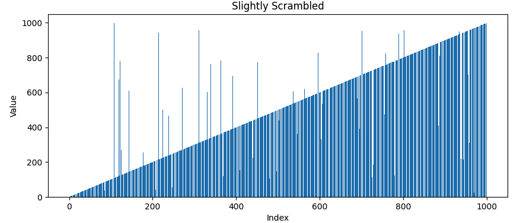
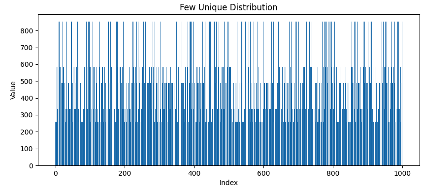

# sorting-alg-benchmark
A comprehensive C++ project benchmarking the performance of various sorting algorithms, including TimSort, IntroSort, MergeSort, QuickSort, and HeapSort, across different data distributions to understand their efficiency and behavior in diverse scenarios

## How to Run
0. Make sure you have installed `CMake`, `make`, and a C++ compiler (e.g., g++)
1. Clone the repository
    ```bash
    git clone https://github.com/NTUCSRC/sorting-alg-benchmark.git
    ```
2. Run the following commands in the terminal:
    ```bash
    cd sorting-alg-benchmark
    mkdir build
    cd build
    cmake ..
    make
    ./sorting-alg-benchmark "distribution"
    ```
## Performance Analysis

### Random Distribution
Description: Generates a list of random integers within a specified range. This distribution is useful for testing sorting algorithms under average, everyday conditions where the input order is completely unsorted and unpredictable.


#### Perfromance
```
----------------------------------------------------------------------
Benchmark                            Time             CPU   Iterations
----------------------------------------------------------------------
InsertionSort/iterations:10    1424192 ns      1420900 ns           10
HeapSort/iterations:10          362762 ns       361100 ns           10
IntroSort/iterations:10         131362 ns       128400 ns           10
MergeSort/iterations:10         890638 ns       880100 ns           10
QuickSort/iterations:10         141204 ns       140800 ns           10
```
### Sorted Distribution
Description: Generates a list of integers in a strictly ascending or descending order. This distribution tests the algorithm's performance on already sorted or inversely sorted data, which can be best-case or worst-case scenarios for some algorithms.


```
----------------------------------------------------------------------
Benchmark                            Time             CPU   Iterations
----------------------------------------------------------------------
InsertionSort/iterations:10      13592 ns        13500 ns           10
HeapSort/iterations:10          190462 ns       190500 ns           10
IntroSort/iterations:10         214183 ns       214100 ns           10
MergeSort/iterations:10         466404 ns       466400 ns           10
QuickSort/iterations:10        1056183 ns      1056000 ns           10
```
### Slightly Scrambled

Description: Starts with a sorted list and introduces a small percentage of randomness by swapping a specified percentage of its elements. It simulates scenarios where the data is nearly sorted but has minor deviations.


```
----------------------------------------------------------------------
Benchmark                            Time             CPU   Iterations
----------------------------------------------------------------------
InsertionSort/iterations:10     125233 ns       125100 ns           10
HeapSort/iterations:10          195267 ns       195200 ns           10
IntroSort/iterations:10         221700 ns       221700 ns           10
MergeSort/iterations:10         476571 ns       475900 ns           10
QuickSort/iterations:10         174004 ns       173600 ns           10
```

### Sorted Blocks
Description: Creates multiple sorted blocks of a specified size, then shuffles these blocks. This distribution checks how sorting algorithms manage partially ordered data, where local order exists, but the overall sequence is unordered.


```
----------------------------------------------------------------------
Benchmark                            Time             CPU   Iterations
----------------------------------------------------------------------
InsertionSort/iterations:10     777242 ns       776600 ns           10
HeapSort/iterations:10          205696 ns       205700 ns           10
IntroSort/iterations:10         798337 ns       798100 ns           10
MergeSort/iterations:10         513550 ns       507200 ns           10
QuickSort/iterations:10         113921 ns       112100 ns           10
```
### Single Big Swap
Description: Divides the list into two halves and swaps their positions. This method is useful for understanding how algorithms deal with large, contiguous segments of data that are out of place.


```
----------------------------------------------------------------------
Benchmark                            Time             CPU   Iterations
----------------------------------------------------------------------
InsertionSort/iterations:10     842975 ns       842300 ns           10
HeapSort/iterations:10          196913 ns       196700 ns           10
IntroSort/iterations:10         423046 ns       422800 ns           10
MergeSort/iterations:10         493033 ns       492800 ns           10
QuickSort/iterations:10         710004 ns       709800 ns           10
```

### Reversed Distribution
Description: Generates a list where the elements are in completely reverse order. This can be particularly challenging for some algorithms and is often considered a worst-case scenario.


```
----------------------------------------------------------------------
Benchmark                            Time             CPU   Iterations
----------------------------------------------------------------------
InsertionSort/iterations:10    1672804 ns      1668900 ns           10
HeapSort/iterations:10          193892 ns       192000 ns           10
IntroSort/iterations:10         237021 ns       235600 ns           10
MergeSort/iterations:10         494196 ns       481800 ns           10
QuickSort/iterations:10        1669842 ns      1666500 ns           10
```
### Few Unique Distribution
Description: Generates a list with a few unique values, repeated multiple times. This distribution tests how sorting algorithms perform when dealing with high-frequency, low-diversity data sets.


```
----------------------------------------------------------------------
Benchmark                            Time             CPU   Iterations
----------------------------------------------------------------------
InsertionSort/iterations:10     715742 ns       715800 ns           10
HeapSort/iterations:10          185108 ns       185100 ns           10
IntroSort/iterations:10         383192 ns       382700 ns           10
MergeSort/iterations:10         495000 ns       494300 ns           10
QuickSort/iterations:10         262100 ns       262000 ns           10
```